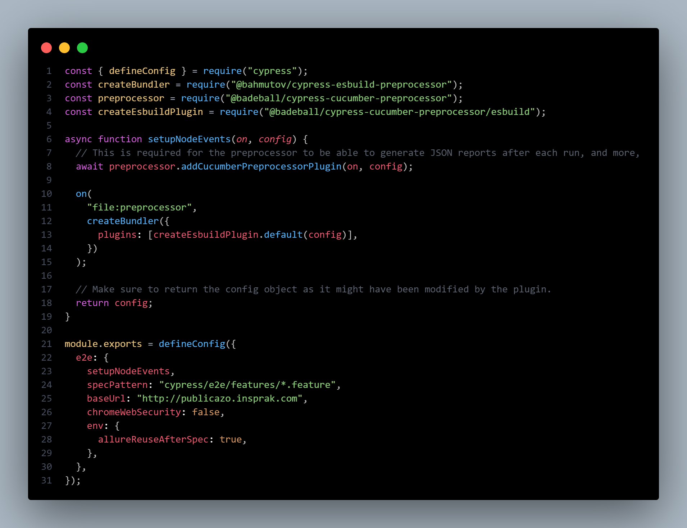
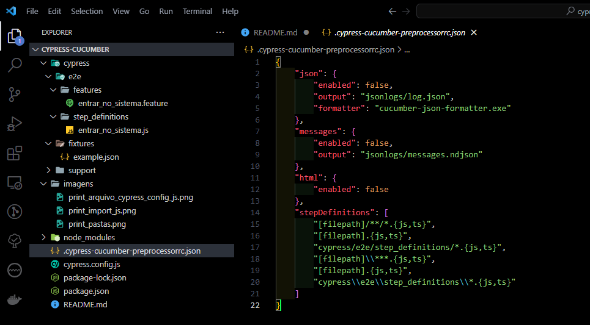
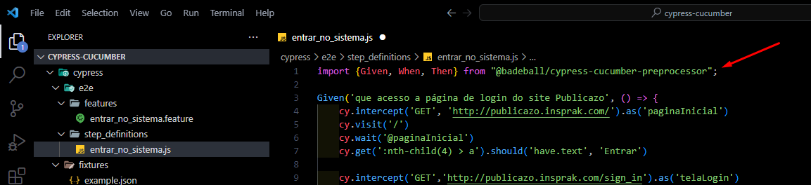
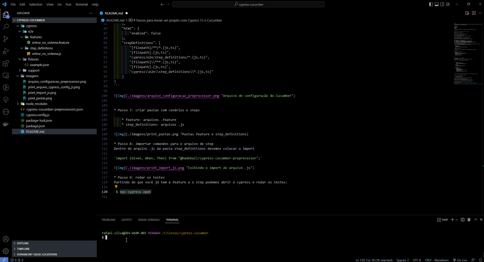
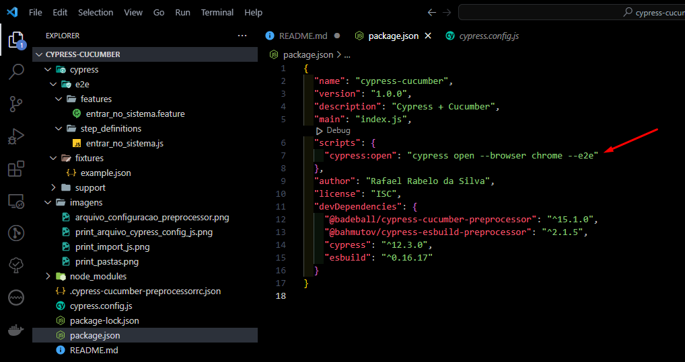

# Projeto

Projeto automação de testes da aplicação web Publicazo usando Cypress e Cucumber. Neste projeto foi utilizado o cucumber para descrever os casos de teste em BDD que vão ser lidos pelo cypress através do empacotador Esbuild.

# Dependências

Foi utilizado:
* Cypress 12
* Cucumber
* Esbuild

Para instalar as dependências deste projeto basta digitar o comando abaixo no terminal:

`$ npm intall`

# Passos para iniciar um projeto com Cypress 12 e Cucumber

Passo 1: iniciar um projeto NodeJs<br>
`$ npm init`

Passo 2: instalar o cypress como dependência de dev<br>
`$ npm install cypress --save-dev`

Passo 3: instalar o preprocessor esbuild<br>
`$ npm i -D cypress @bahmutov/cypress-esbuild-preprocessor esbuild`

Passo 4: instalar o cucumber<br>
`$ npm install @badeball/cypress-cucumber-preprocessor --save-dev`

Passo 5: substituir o que está no arquivo `cypress.config.js`<br>
Dentro do arquivo `cypress.config.js` substituir pelo script abaixo:

```
const { defineConfig } = require("cypress");
const createBundler = require("@bahmutov/cypress-esbuild-preprocessor");
const preprocessor = require("@badeball/cypress-cucumber-preprocessor");
const createEsbuildPlugin = require("@badeball/cypress-cucumber-preprocessor/esbuild");
const allureWriter = require("@shelex/cypress-allure-plugin/writer");

async function setupNodeEvents(on, config) {
  // This is required for the preprocessor to be able to generate JSON reports after each run, and more,
  await preprocessor.addCucumberPreprocessorPlugin(on, config);

  on(
    "file:preprocessor",
    createBundler({
      plugins: [createEsbuildPlugin.default(config)],
    })
  );
  allureWriter(on, config);

  // Make sure to return the config object as it might have been modified by the plugin.
  return config;
}

module.exports = defineConfig({
  e2e: {
    setupNodeEvents,
    specPattern: "cypress/e2e/features/*.feature",
    baseUrl: "http://publicazo.insprak.com",
    chromeWebSecurity: false,
    env: {
      allureReuseAfterSpec: true,
    },
  },
});
```

Seu arquivo deverá ficar desta maneira:<br>
cypress.config.js


* Passo 6: criar o arquivo json de configuração do preprocessor

nome do arquivo: .cypress-cucumber-preprocessorrc.json

```
{
    "json": {
        "enabled": false,
        "output": "jsonlogs/log.json",
        "formatter": "cucumber-json-formatter.exe"
    },
    "messages": {
        "enabled": false,
        "output": "jsonlogs/messages.ndjson"
    },
    "html": {
        "enabled": false
    },
    "stepDefinitions": [
        "[filepath]/**/*.{js,ts}",
        "[filepath].{js,ts}",
        "cypress/e2e/step_definitions/*.{js,ts}",
        "[filepath]\\***.{js,ts}",
        "[filepath].{js,ts}",
        "cypress\\e2e\\step_definitions\\*.{js,ts}"
    ]
}
```




* Passo 7: criar pastas com cenários e steps

    * feature: arquivos .feature
    * step_definitions: arquivos .js


* Passo 8: importar comandos para o arquivo de step<br>
Dentro do arquivo .js da pasta step_definitions devemos colocar o import:

`import {Given, When, Then} from "@badeball/cypress-cucumber-preprocessor";`



* Passo 9: rodar os testes<br>
Assumindo que você já tem a feature e o step podemos abrir o cypress e rodar os testes:

`$ npx cypress open`



# Configurações adicionais

* Se você, como eu sempre utiliza o e2e e o Chrome para executar os testes basta colocar o script abaixo no arquivo package.json que irá pular essas etapas agilizando ainda mais o processo de testes:
```
  "scripts": {
    "cypress:open": "cypress open --browser chrome --e2e"
  },
```


# Observações

* Pasta plugins<br>
A partir do cypress 10 não existe mais a pasta plugins. Todos os plugins são colocados dentro do arquivo cypress.config.js